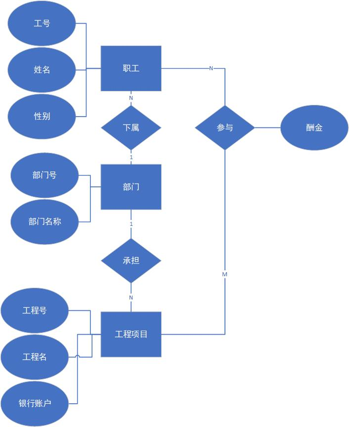
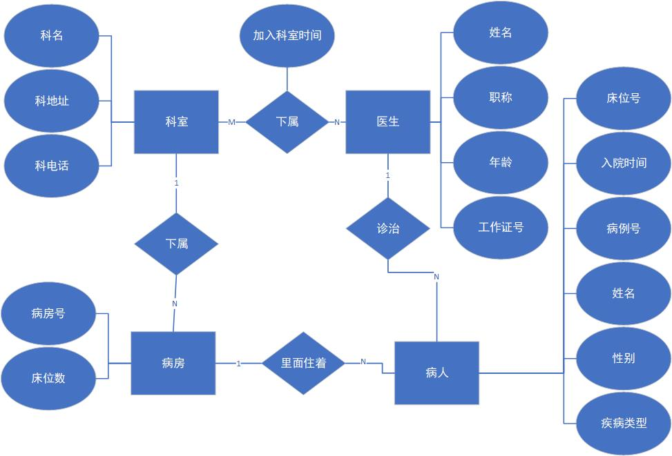

## 1

关系模式

职工: (**工号**, 性别, 姓名, *部门号*)

部门: (**部门号**, 部门名称)

工程: (**工程号**, 工程名, 银行账户, *部门号*)

职工-工程: (**{职工号, 工程号}**, 酬金)

## 2

关系模式

医生: (**工作证号**, 姓名, 职称, 年龄)

病人: (**病例号**, 姓名, 性别, 疾病类型, *医生.工作证号*, *病房号*, 入院时间, 床位号)

病房: (**病房号**, 床位数, *科名*)

科室: (**科名**, 科地址, 科电话)

医生-科室: (**{科名, 工作证号}**, 加入科室时间)
